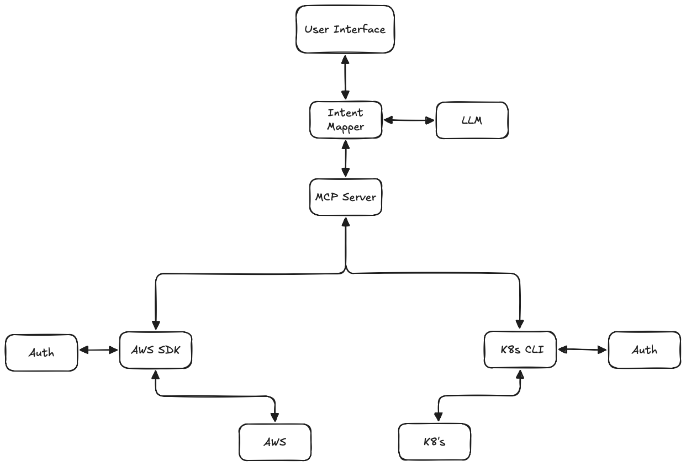

# AWS MCP

A [Model Context Protocol (MCP)](https://www.anthropic.com/news/model-context-protocol) server that enables AI assistants like Claude to interact with your AWS environment. This allows for natural language querying and management of your AWS resources during conversations. Think of it as a better Amazon Q alternative.

## Features

- Query and modify AWS resources using natural language
- Support for multiple AWS profiles
- Multi-region support
- Local execution with your AWS credentials

## Workflow



## Prerequisites

- [Python](https://www.python.org/downloads/)
- [Claude Desktop](https://claude.ai/download)
- AWS credentials configured locally (`~/.aws/` directory)

## Installation

1. Clone the repository:

```bash
git clone https://github.com/yourusername/aws-mcp
cd aws-mcp
```

2. Install the Python MCP server:

```bash
pip install -e .
```

## Using as a CLI

The AWS MCP can also be used as a command-line interface:

```bash
# Show available commands
python -m aws_mcp --help

# List available AWS profiles
python -m aws_mcp list-credentials

# Select an AWS profile
python -m aws_mcp select-profile myprofile

# Run AWS operations
python -m aws_mcp run-aws-code "list all S3 buckets"

# Use pretty formatting for more readable output
python -m aws_mcp --format pretty list-credentials
```

Note: Replace `python` with the path to your Python executable if needed.

## Usage with Claude Desktop

1. Open Claude desktop app and go to Settings -> Developer -> Edit Config

2. Add the following entry to your `claude_desktop_config.json`:

```json
{
  "mcpServers": {
    "aws-mcp": {
      "command": "/path/to/your/python",
      "args": ["/path/to/your/aws-mcp/run_aws_mcp.py"]
    }
  }
}
```

Important: Replace `/path/to/your/python` with the result of `which python` from your terminal.
Important: Replace `/path/to/your/aws-mcp/run_aws_mcp.py` with the actual path to the run_aws_mcp.py file.

3. Restart Claude desktop app. You should see this no errors:

4. Start by selecting an AWS profile or jump to action by asking:
   - "List available AWS profiles"
   - "List all EC2 instances in my account"
   - "Show me S3 buckets with their sizes"
   - "What Lambda functions are deployed in us-east-1?"
   - "List all ECS clusters and their services"

## Troubleshooting

To see logs:

```bash
tail -n 50 -f ~/Library/Logs/Claude/mcp-server-aws-mcp.log
# or
tail -n 50 -f ~/Library/Logs/Claude/mcp.log
```

## Features in Development

- [ ] MFA support
- [ ] Cache SSO credentials to prevent from refreshing them too eagerly

## Contact

For questions, suggestions, or discussions about AWS MCP, please:
- Open an issue on GitHub
- Email: arun.sanna@outlook.com

Check out [CONTRIBUTING.md](./CONTRIBUTING.md) for information on how to contribute to this project.

## AWS Integration

AWS MCP supports dynamic execution of AWS operations using boto3. It can:

1. Parse natural language or code-like requests to determine the AWS service and operation
2. Automatically execute the appropriate boto3 command
3. Format results in a readable table when possible
4. Handle errors gracefully

### Supported Services

The parser can dynamically recognize and work with all AWS services available through boto3, including:

- S3
- EC2
- Lambda
- IAM
- DynamoDB
- RDS
- CloudFormation
- CloudWatch
- SNS
- SQS
- KMS
- Secrets Manager
- SSM
- Route53
- CloudFront
- Elastic Beanstalk
- API Gateway
- ECS
- STS
- Cognito
- CodeBuild
- CodeCommit
- CodePipeline
- Organizations
- GuardDuty
- ...and many more!
